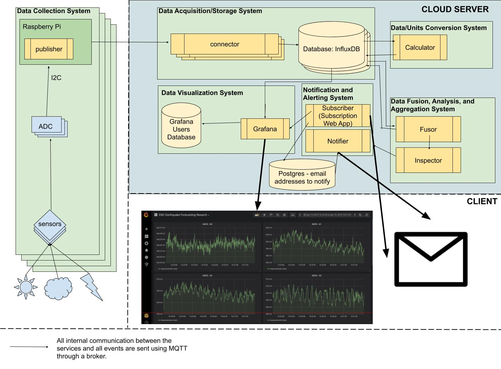

# Data Assimilation: Sensor Data Acquisition, Visualization, Analysis and Monitoring Platform

This repository contains the docker-compose and configuration files for the deployment of the Data Acquisition, Visualization and Monitoring Platform. It makes use of our [MQTT Connector container](https://github.com/encresearch/connector), in charge of receiving and storing the sensors' data into an [InfluxDB](https://www.influxdata.com/). Additionally, [Grafana](https://grafana.com/) is served as a web application for both data visualization and monitoring. Upcoming services: ```calculator```, ```TEC data receiver```, and ```data fusion```.

## Dependencies and Setup
### Docker
Install [Docker](https://docs.docker.com/install/) and [Docker-Compose](https://docs.docker.com/compose/install/).

## Install and Run Locally
1. Clone the repo.
    ```git clone https://github.com/encresearch/data-assimilation-system.git```

2. Build images and run containers.
    **prod**
    This file includes the creation of persistent [docker volumes](https://docs.docker.com/storage/volumes/) and contains its own database containers. For testing environments, use the **dev** yml file.
    ```docker-compose -f docker-compose.yml up -d```
    
    **Dev**
    The ```docker-compose.dev.yml``` file builds the docker image using the files on your local machine and not pulled from our docker hub (our current production container). That way, all your local changes will take place when building the container.
    ```docker-compose -f docker-compose.dev.yml up -d```
    This command will spin up both the ```connector``` container, ```grafana```,  and an ```influxdb``` container.

    To stop and remove containers, networks and images created by up (external volumes won't be removed).
    ```docker-compose -f docker-compose.dev.yml down```

## Services

### InfluxDB
[InfluxDB](https://www.influxdata.com/) will be used to store our incoming sensor data. For data persistency, a docker volume ```influx_data``` is created. To access the **CLI** thorugh a container, enter ```docker exec -it influxdb influx```. For configuration and environment variables, see [here](https://hub.docker.com/_/influxdb/).
### Grafana
[Grafana](https://grafana.com/) will be used as web application for data visualization. It runs on port 3000 on the container, which is then mapped to port 80 on the host. For data persistency, a volume named ```grafana_data``` is created.
**Configuration**
The configuration file can be found in the ```etc/``` directory. As of now, the only used configuration is pointing the root url to the host's IP. For more info, see [grafana configuration docs](http://docs.grafana.org/installation/configuration/).
### Connector
[Python application](https://github.com/encresearch/connector) that receives raw measurements data from an MQTT Broker, calculates actual values and stores them in InfluxDB before sending an event message to calculator.
### Calculator
Reads raw data from `InfluxDB`, converts it into the desired values, and adds the data back into new measurements in influxdb based on their location and sensor before notifying inspector about it.
### Inspector
[Python application](https://github.com/encresearch/inspector) that constantly scans data and detects breaking of thresholds values and triggers an alert as an email trough `notifier`.
### Notifier
A [service](https://github.com/encresearch/notifier) that queries a database containing subscribers (and the topics they are subscribed to), and sends an email to the subscribers of the respective topic specified by inspector.
### Subscriber
Python flask UI [application](https://github.com/encresearch/subscriber) for users to update the alerting email notifications to be received by notifier.
### Fusor [WORK IN PROGRESS]
Earthquake Precursors Machine Learning algorithms [application](https://github.com/encresearch/fusor).
### Telegraf [WORK IN PROGRESS]
Plugin-driven server agent for collecting and reporting metrics about the hosting server. Data is also stored in InfluxDB. Configuration file can also be found in the ```etc/``` directory.
### Watchtower
Checks changes made to the images that containers were originally started from. If a change is detected, it will automatically restart the container using the new image. For more info, visit [here](https://hub.docker.com/r/centurylink/watchtower/)

## Contributing
Pull requests and stars are always welcome. To contribute, please fetch, create an issue explaining the bug or feature request, create a branch off this issue and submit a pull request.
